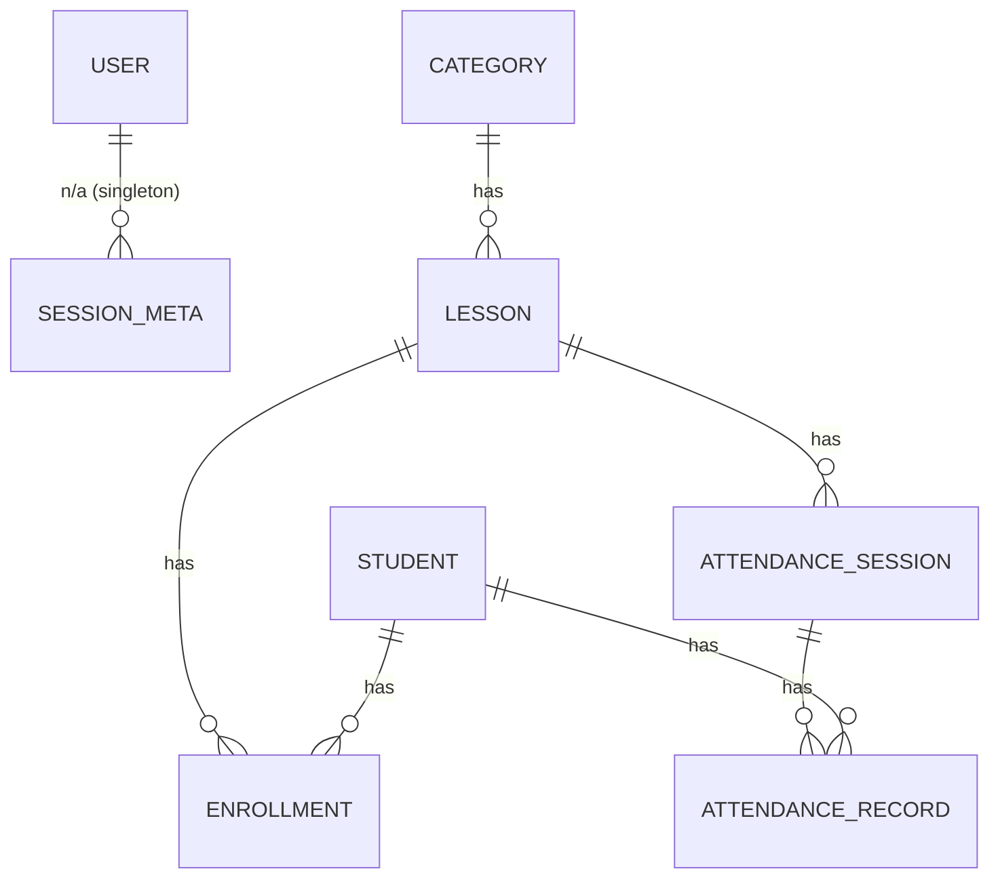
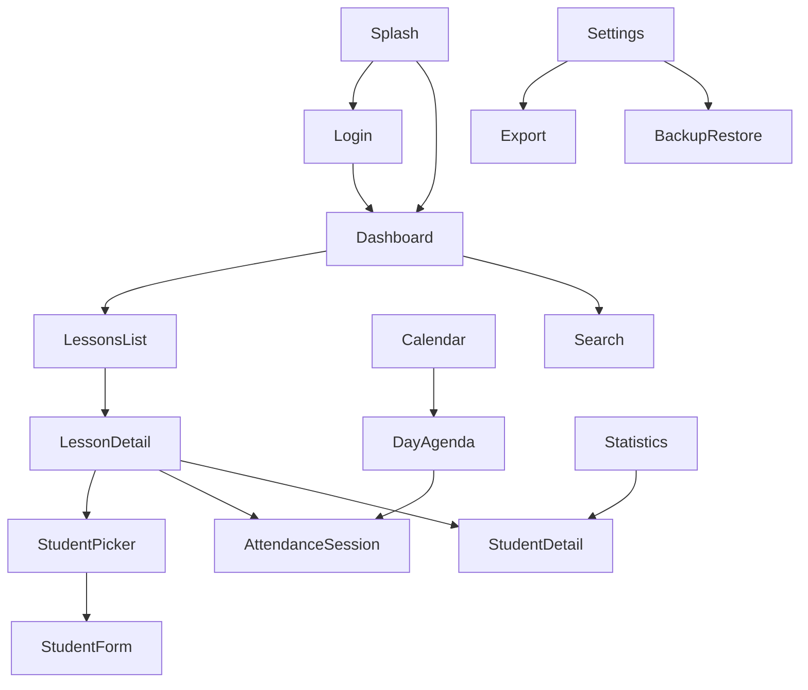

# Implementation Plan — Lesson & Attendance Monitoring App

Status: **Planning complete — Phase 1**. This document is the frozen "on-paper" plan required before implementation starts (Mandatory Workflow, step 1). It is not a living document (that role belongs to `APP_LOGIC.md`), but it may be amended if a later milestone reveals the plan was wrong — any such change must be noted in `APP_LOGIC.md` as a deviation.

Package name (placeholder, rename freely): `com.example.lessonmonitor`

---

## 1. Explicit Assumptions (per prompt's "state assumptions" instruction)

| # | Ambiguity | Assumption / Decision |
|---|---|---|
| 1 | "Single local user" scope | Exactly one local profile is ever created (no username, just PIN/password). No user list/switching. |
| 2 | Facilitator/place location in hierarchy | Stored as defaults on `Lesson`, with optional per-occurrence overrides on `AttendanceSession` (a recurring lesson's facilitator/room can change week to week without editing the template). |
| 3 | Cascade delete UX | Hard delete with `ON DELETE CASCADE` at the Room FK level, but the UI always queries and displays exact impact counts ("This will delete 4 lessons, 12 sessions, 96 attendance records") before the user confirms. No soft-delete/trash system — considered, rejected as over-scope for Phase 1. |
| 4 | Recurring session generation | Sessions are generated lazily into a **rolling 60-day lookahead window** (not upfront for all time, not purely on-demand-per-tap), recomputed idempotently whenever the app opens, the Calendar screen is opened, or the user scrolls the calendar past the current window edge. |
| 5 | Notification precision | `AlarmManager` (`setExactAndAllowWhileIdle`) schedules one alarm per upcoming session inside the lookahead window; a daily `WorkManager` job handles housekeeping (regenerate window + reschedule alarms), since WorkManager alone can't guarantee lesson-start-time precision. |
| 6 | Backup format | JSON snapshot (entities serialized via kotlinx.serialization) rather than a raw `.db` file copy — safer across schema/version changes and human-inspectable. |
| 7 | Search placement | A dedicated Search screen reachable from the Dashboard top app bar (not a 5th bottom-nav tab), plus inline filter chips on Lessons/Students lists. |
| 8 | Attendance statuses | Present / Absent / Late / Excused (4 statuses), per the prompt's suggestion, confirmed as in-scope. |
| 9 | Student deletion | Deleting a Student cascades to their `Enrollment` and `AttendanceRecord` rows (their history is genuinely removed) — same hard-delete + confirm-count pattern as #3. |

---

## 2. Data Model (Room)



### `User` (singleton row)
| Field | Type | Notes |
|---|---|---|
| id | Long PK | always `1` |
| passwordHash | String | PBKDF2WithHmacSHA256 derived hash (Base64) |
| salt | String | random per-install, Base64 |
| biometricEnabled | Boolean | |
| createdAt | Long (epoch millis) | |

> Note: hash/salt actually live in an **encrypted DataStore** (see §6 Security), not a plain Room table, even though the Room `User` entity models the concept for schema completeness/tests. Implementation milestone will confirm final storage location; if changed, update here and in `APP_LOGIC.md`.

### `Category`
| Field | Type | Notes |
|---|---|---|
| id | Long PK autogenerate | |
| name | String | required |
| description | String? | |
| color | Int? | ARGB |
| icon | String? | icon key/emoji |
| createdAt / updatedAt | Long | |

### `Lesson`
| Field | Type | Notes |
|---|---|---|
| id | Long PK autogenerate | |
| categoryId | Long FK → Category.id, `CASCADE` | |
| title | String | |
| description | String? | |
| facilitatorName | String? | default, overridable per session |
| place | String? | default, overridable per session |
| isRecurring | Boolean | |
| recurrenceType | String enum: `NONE, DAILY, WEEKLY, CUSTOM_DAYS` | |
| recurrenceDaysOfWeek | String? | CSV of ISO day ints, used when `WEEKLY`/`CUSTOM_DAYS` |
| startDate | Long (epoch day) | first occurrence / one-off date |
| endDate | Long? (epoch day) | optional recurrence end |
| startTime / endTime | Int? (minutes since midnight) | for notifications & calendar |
| createdAt / updatedAt | Long | |

### `Student` (global, reusable)
| Field | Type | Notes |
|---|---|---|
| id | Long PK autogenerate | |
| name | String | |
| photoPath | String? | internal storage file path |
| phone | String? | |
| email | String? | |
| notes | String? | |
| createdAt / updatedAt | Long | |

### `Enrollment` (Lesson N–N Student)
| Field | Type | Notes |
|---|---|---|
| id | Long PK autogenerate | |
| lessonId | Long FK → Lesson.id, `CASCADE` | |
| studentId | Long FK → Student.id, `CASCADE` | |
| enrolledAt | Long | |
| active | Boolean | "removed from roster" = `active=false`, row kept for audit; does **not** delete `AttendanceRecord` history (records reference `studentId` directly, not `enrollmentId`) |

### `AttendanceSession` (one per lesson occurrence/date)
| Field | Type | Notes |
|---|---|---|
| id | Long PK autogenerate | |
| lessonId | Long FK → Lesson.id, `CASCADE` | |
| sessionDate | Long (epoch day) | |
| facilitatorOverride | String? | |
| placeOverride | String? | |
| notes | String? | |
| createdAt | Long | |

Unique index on `(lessonId, sessionDate)` to keep generation idempotent.

### `AttendanceRecord` (per student per session)
| Field | Type | Notes |
|---|---|---|
| id | Long PK autogenerate | |
| sessionId | Long FK → AttendanceSession.id, `CASCADE` | |
| studentId | Long FK → Student.id, `CASCADE` | |
| status | String enum: `PRESENT, ABSENT, LATE, EXCUSED` | |
| absenceReason | String? | relevant when `ABSENT`/`EXCUSED` |
| recordedAt | Long | |

Unique index on `(sessionId, studentId)`.

### Cascade-delete matrix

| Delete this | Cascades to |
|---|---|
| Category | Lessons → Enrollments, AttendanceSessions → AttendanceRecords |
| Lesson | Enrollments, AttendanceSessions → AttendanceRecords (Students untouched) |
| Student | Enrollments, AttendanceRecords referencing them (Lessons/Sessions untouched) |

All destructive UI actions must run a count query first and render it in the confirmation dialog.

---

## 3. Roadblocks & Resolutions (thought through up front)

1. **Cascade deletes losing history** → resolved above (hard delete + pre-count confirmation; explicitly rejected soft-delete/trash to avoid over-scoping Phase 1).
2. **Recurring session generation blow-up** (a weekly lesson with no end date could generate infinite rows) → rolling 60-day lookahead window, regenerated lazily & idempotently (unique index prevents duplicates).
3. **Notification timing precision vs. battery/doze** → `AlarmManager.setExactAndAllowWhileIdle` per session + daily `WorkManager` housekeeping job to keep the alarm set fresh as the window rolls forward.
4. **Local credential security** → never store plaintext or a reversible value; PBKDF2 hash+salt kept in an encrypted DataStore backed by an Android Keystore master key; plain (non-encrypted) DataStore only holds the transient `isLoggedIn` boolean.
5. **Student reused across lessons vs. per-lesson attendance history** → `AttendanceRecord` keys off `studentId` directly (not `enrollmentId`), so unenrolling a student from a lesson never touches their historical records for that lesson.
6. **Phase 2 cloud-sync bolt-on** → all data access goes through `domain/repository/*` interfaces; ViewModels depend only on interfaces; Impl classes currently wrap Room DAOs only. A `RemoteDataSource` + sync strategy can be added inside the Impl later without touching ViewModels/UI.

---

## 4. Screens & Navigation

### Screen list
1. `Splash` — checks session flag, routes to `Login` or `Dashboard`.
2. `CreateCredential` — first-run PIN/password setup.
3. `Login` — PIN/password + optional biometric prompt.
4. `Dashboard` — Category list (bottom-nav root), + search icon in top bar.
5. `CategoryForm` — add/edit category.
6. `LessonsList` — lessons within a category, + filter chips.
7. `LessonForm` — add/edit lesson incl. recurrence config.
8. `LessonDetail` — facilitator/place, roster tab, sessions-list tab.
9. `StudentPicker` — add existing / create new student onto a roster.
10. `StudentForm` — create/edit a student profile.
11. `StudentDetail` — profile + attendance history across all lessons.
12. `AttendanceSession` — mark each roster student's status + reason for one occurrence.
13. `Calendar` — month/week view (bottom-nav tab).
14. `DayAgenda` — bottom sheet/screen listing sessions on a tapped date.
15. `Search` — global search across categories/lessons/students.
16. `Statistics` — per-student %, per-lesson %, charts (bottom-nav tab).
17. `Settings` — dark mode, logout, biometric toggle, notif prefs, links to Export/Backup (bottom-nav tab).
18. `Export` — pick category/lesson → CSV → share sheet.
19. `BackupRestore` — export/import JSON snapshot.

### Navigation graph (Compose Navigation)
- `auth` graph: `Splash → {CreateCredential | Login}`.
- `main` graph: Scaffold with bottom nav (`Dashboard`, `Calendar`, `Statistics`, `Settings`), each a nested graph so state survives tab switches.
- Shared detail routes (pushed on top of whichever tab): `category/{id}/lessons`, `lesson/{id}`, `lesson/{id}/session/{sessionId}`, `student/{id}`, `search`, `export`, `backupRestore`.
- Notification deep link: `app://lesson/{lessonId}/session/{sessionId}` → opens directly into `AttendanceSession`.



---

## 5. Package Structure

```
com.example.lessonmonitor
 ├─ data/
 │   ├─ local/        (Room entities, DAOs, AppDatabase, TypeConverters)
 │   ├─ datastore/     (session + encrypted credential managers)
 │   ├─ repository/    (Repository impl — wraps local DAOs today, remote later)
 │   ├─ export/        (CSV writer, JSON backup/restore)
 │   └─ worker/        (WorkManager: session-window generator, alarm rescheduler)
 ├─ domain/
 │   ├─ model/         (plain domain models, decoupled from Room entities)
 │   ├─ repository/    (interfaces — the Phase-2 swap point)
 │   └─ usecase/       (RecurrenceCalculator, AttendanceStatsCalculator, etc.)
 ├─ ui/
 │   ├─ auth/ dashboard/ category/ lesson/ attendance/ student/
 │   │   calendar/ search/ statistics/ settings/
 │   ├─ components/    (shared composables)
 │   └─ theme/          (M3 theme, dark mode)
 ├─ navigation/         (NavGraph, routes, deep links)
 ├─ di/                 (Hilt modules)
 └─ util/               (Result wrappers, date utils, security utils)
```

---

## 6. Tech Decisions

- **DI:** Hilt (per prompt preference).
- **Charts:** hand-rolled Compose `Canvas` bar/percentage charts for Phase 1 — avoids a heavy charting dependency; revisit Vico if requirements grow.
- **Export:** CSV built manually (no library needed), written to app-specific external storage, shared via `FileProvider` + `ACTION_SEND`.
- **Backup/Restore:** JSON snapshot (kotlinx.serialization) of all entities with a `schemaVersion` field, not a raw DB file copy.
- **Security:** PBKDF2WithHmacSHA256 (random salt) for the credential hash; hash+salt stored via `androidx.security.crypto` (Keystore-backed master key) DataStore/EncryptedFile; plain DataStore only for the `isLoggedIn` session flag; optional `BiometricPrompt` gate.
- **Testing:** JUnit + MockK + Turbine (Flow testing) for ViewModel/Repository unit tests, added per-milestone; Robolectric only if a milestone specifically needs it.

---

## 7. Milestones (each = one commit, per Mandatory Workflow)

1. Planning docs (`PLAN.md`, `APP_LOGIC.md` started) — **this commit**.
2. Initial Android Studio project setup (Gradle, package skeleton, Hilt/Compose/Room deps wired, empty scaffold builds).
3. Room schema (all entities/DAOs/TypeConverters/AppDatabase + migrations baseline).
4. Navigation skeleton (all routes wired with placeholder screens).
5. Feature: User account (local-only) — credential setup, login, biometric, session persistence, logout.
6. Feature: Category & Lesson CRUD (incl. cascade-delete confirmation).
7. Feature: Attendance tracking (roster + per-session marking).
8. Feature: Student profiles (profile CRUD, photo, cross-lesson history).
9. Feature: Recurring/scheduled lessons (rolling window generation).
10. Feature: Calendar/schedule view.
11. Feature: Search & filter.
12. Feature: Attendance statistics dashboard.
13. Feature: Export/backup (CSV + JSON snapshot restore).
14. Feature: Notifications/reminders (AlarmManager + WorkManager housekeeping).
15. Feature: Dark mode.
16. Final docs pass (`README.md`, `ARCHITECTURE.md` Phase 2 notes) + unit test coverage sweep.

`APP_LOGIC.md` is updated at the end of every milestone from #5 onward (and touched now at #1).
